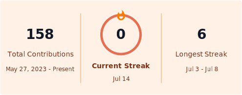

# Hi there

I build practical tools with Python, data workflows, and backend systems. I like turning messy, repetitive problems into reliable automation, clean scripts, and useful applications.

  
  
  
  

## At A Glance

- Building small tools that make repetitive work easier.
- Exploring data analysis, regression modeling, and backend fundamentals.
- Keeping projects practical, readable, and a little bit satisfying to use.

## GitHub Stats

## Toolbox

  
  
  
  
  
  

Thanks for stopping by. Feel free to explore what I'm building.
